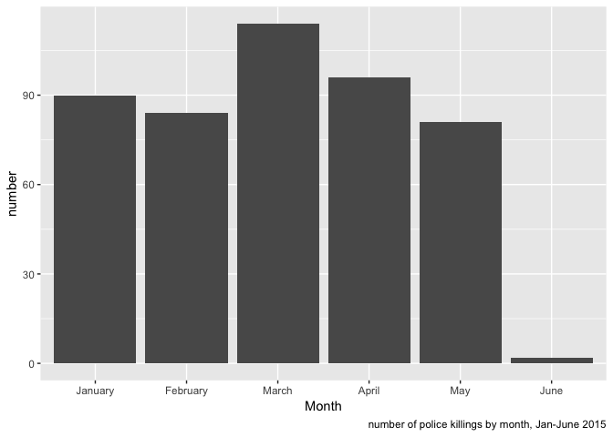
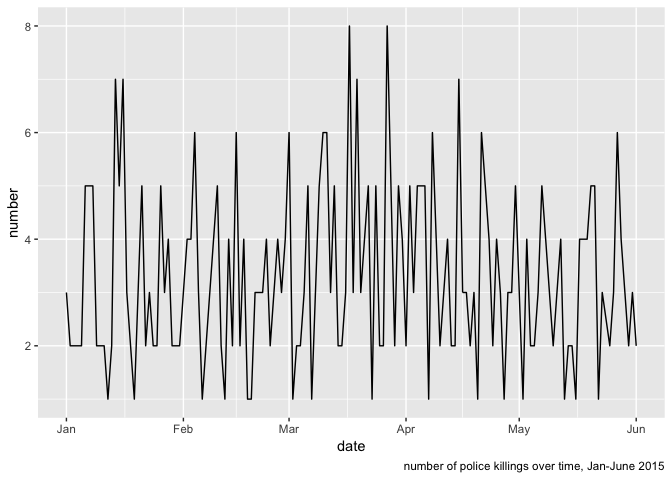

Time-dependent analysis
================
Nathalie Fadel
11/30/2018

Data import and cleaning
========================

``` r
raw_data = read_csv("https://raw.githubusercontent.com/fivethirtyeight/data/master/police-killings/police_killings.csv") %>%
  janitor::clean_names()
```

    ## Parsed with column specification:
    ## cols(
    ##   .default = col_character(),
    ##   day = col_integer(),
    ##   year = col_integer(),
    ##   latitude = col_double(),
    ##   longitude = col_double(),
    ##   state_fp = col_integer(),
    ##   county_fp = col_integer(),
    ##   tract_ce = col_integer(),
    ##   geo_id = col_double(),
    ##   county_id = col_integer(),
    ##   pop = col_integer(),
    ##   h_income = col_integer(),
    ##   county_income = col_integer(),
    ##   comp_income = col_double(),
    ##   county_bucket = col_integer(),
    ##   nat_bucket = col_integer(),
    ##   urate = col_double(),
    ##   college = col_double()
    ## )

    ## See spec(...) for full column specifications.

``` r
clean_data = raw_data %>%
  mutate(month = factor(month, levels = c("January", "February", "March", "April", "May", "June", "July", "August", "September", "October", "November", "December")),
         year = as.integer(year))

clean_data %>%
  group_by(month) %>%
  summarise(total_killed = n()) %>%
  ggplot(aes(x = month, y=total_killed)) +
  geom_col(size = 3) +
  labs(x = "Month", y = "number", 
       caption = "number of police killings by month, Jan-June 2015") 
```



``` r
date_data = clean_data %>%
  mutate(month = as.integer(month)) %>%
  mutate(date = paste(month, day, year, sep = "-")) %>%
  mutate(date = as.Date(date, "%m-%d-%Y"))

date_data %>%
  group_by(date) %>%
  summarise(total_killed = n()) %>%
  ggplot(aes(x = date, y=total_killed)) +
  geom_line(size = 0.5) +
  labs(x = "date", y = "number", 
       caption = "number of police killings over time, Jan-June 2015")
```



Plan:
=====

-   Geom\_point plot of killings in y axis vs time in x axis
-   Date w highest number of killings (or month), location(s) in which they occurred
-   Density plot of killings over time
-   Map of killings w date
-   If counties/states have multiple, single these out
