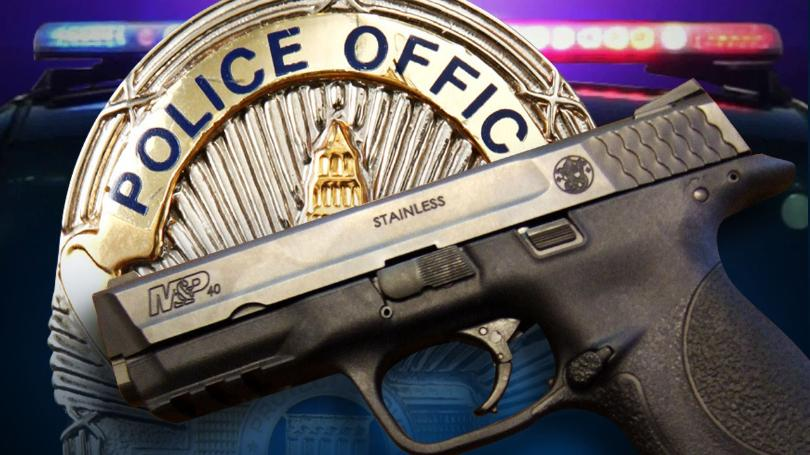

##2015-2016

Police killings of citizens has been a point of tension in American culture over the past few years. With recent high profile police killings of African Americans like Eric Garner, Michael Brown Jr., Freddie Gray, Philando Castile and many others, we were interested in looking into what the data tells us about recent police killings. 